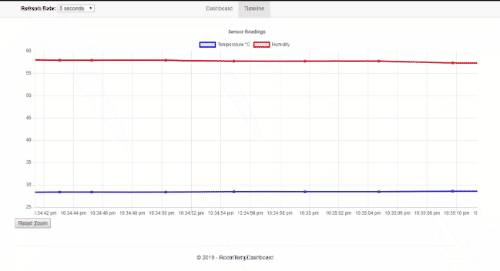
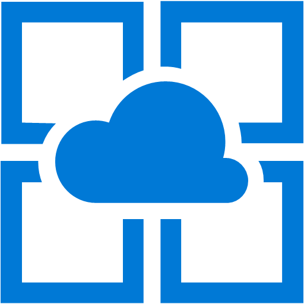
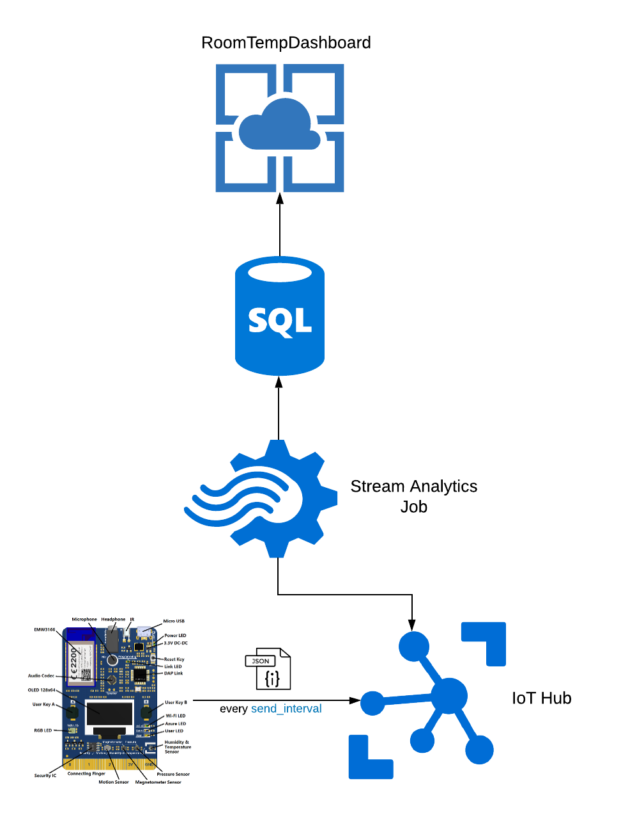

# RoomTempDashboard


Web dashboard for displaying temperature and humidity data from [RoomTempDevice-IoT](https://github.com/SeanoNET/RoomTempDevice-IoT) or local stack [RoomTempMQTTConsumer](https://github.com/SeanoNET/RoomTempMQTTConsumer)

### Dashboard


### Timeline


## Azure services
-  [App Service](https://azure.microsoft.com/en-au/services/app-service/)
-  [SQL Database](https://azure.microsoft.com/en-au/services/sql-database/)
-  [Azure Stream Analytics](https://azure.microsoft.com/en-au/services/stream-analytics/)
-  [Azure IoT Hub](https://azure.microsoft.com/en-au/services/iot-hub/)



## Getting Started

Install [.NET Core](https://dotnet.microsoft.com/download) version 3.1 or above

- `git clone https://github.com/SeanoNET/RoomTempDashboard.git`
- `cd RoomTempDashboard/src`
- `dotnet restore && dotnet run`

### Config
Add `DataSource` connection string to your `appsettings.json` see [Creating the SQL Database](#Creating-the-SQL-Database)

> If running the local version of the [RoomTempMQTTConsumer](https://github.com/SeanoNET/RoomTempMQTTConsumer) you do not need to create the database and tables manually.

```JSON
{
  "Logging": {
    "LogLevel": {
      "Default": "Warning",
      "Hangfire": "Information"
    }
  },
  "AllowedHosts": "*",
  "DataSource": "Host=localhost;Database=MQTT;Username=postgres;Password=St0ngPassword1!"
}
```

## Running locally in Docker

Install [Docker](https://docs.docker.com/get-docker/)

### Building the image

Build the image with

`docker build -t roomtempdashboard:latest .`

### Running in Docker

`docker container run -p 80:80 -e DataSource="<ConnectionString>" --name roomtempdash roomtempdashboard:latest`

see for [RoomTempMQTTConsumer](https://github.com/SeanoNET/RoomTempMQTTConsumer) running the stack locally.

## Configuring the MXChip and IoT Hub

For configuring the MXChip/IoT Hub and for uploading device code see [RoomTempDevice-IoT Getting Started](https://github.com/SeanoNET/RoomTempDevice-IoT#getting-started)

## Stream Analytics

The [Stream Analytics](https://docs.microsoft.com/en-us/azure/stream-analytics/stream-analytics-introduction) job will process the events from the [payload](https://github.com/SeanoNET/RoomTempDevice-IoT#payload) sent to [IoT Hub](https://azure.microsoft.com/en-au/services/iot-hub/) and output the data into the [MSSQL data source](#Creating-the-SQL-Database) so the RoomTempDashboard can retrieve the data.

### Creating the Stream Analytics job <a name="Creating-the-Stream-Analytics-job"></a>

- [Create a Stream Analytics job](https://docs.microsoft.com/en-us/azure/stream-analytics/stream-analytics-quick-create-portal#create-a-stream-analytics-job)
- [Configure job input](https://docs.microsoft.com/en-us/azure/stream-analytics/stream-analytics-quick-create-portal#configure-job-input) name it `iptSensorData`
- [Configure job output](https://docs.microsoft.com/en-us/azure/stream-analytics/stream-analytics-quick-create-portal#configure-job-output) name it `optSensorData` *Select SQL Database instead of Blob storage and select `SensorData` table*


### [Transformation Query](https://docs.microsoft.com/en-us/azure/stream-analytics/stream-analytics-quick-create-portal#define-the-transformation-query)
```SQL
SELECT 
    CAST(TEMPERATURE AS float) AS Temperature,
    CAST(HUMIDITY AS float) AS Humidity,
    CAST(EVENTPROCESSEDUTCTIME AS datetime) as MeasuredAt
INTO
    optSensorData
FROM
    iptSensorData
```

## Creating the SQL Database <a name="Creating-the-SQL-Database"></a>

> If running the local version of the [RoomTempMQTTConsumer](https://github.com/SeanoNET/RoomTempMQTTConsumer) you do not need to create the database and tables manually.

Create a table called `SensorData` - The output from the [Stream Analytics Job](#Creating-the-Stream-Analytics-job)

```SQL
CREATE TABLE [dbo].[SensorData](
	[ID] [int] IDENTITY(1,1) NOT NULL,
	[Temperature] [decimal](18, 13) NULL,
	[Humidity] [decimal](18, 13) NULL,
	[MeasuredAt] [datetime] NULL,
 CONSTRAINT [PK_SensorData] PRIMARY KEY CLUSTERED 
(
	[ID] ASC
)WITH (STATISTICS_NORECOMPUTE = OFF, IGNORE_DUP_KEY = OFF) ON [PRIMARY]
) ON [PRIMARY]
GO
```

## Icons
[Microsoft Azure, Cloud and Enterprise Symbol / Icon Set](https://www.microsoft.com/en-au/download/details.aspx?id=41937)